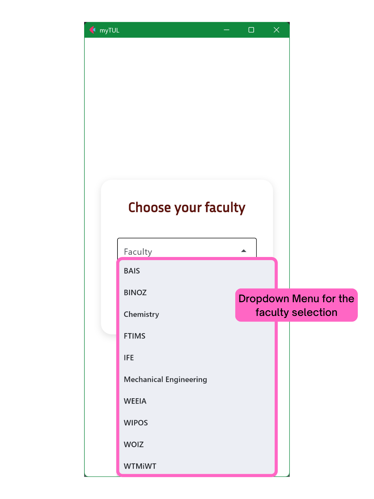
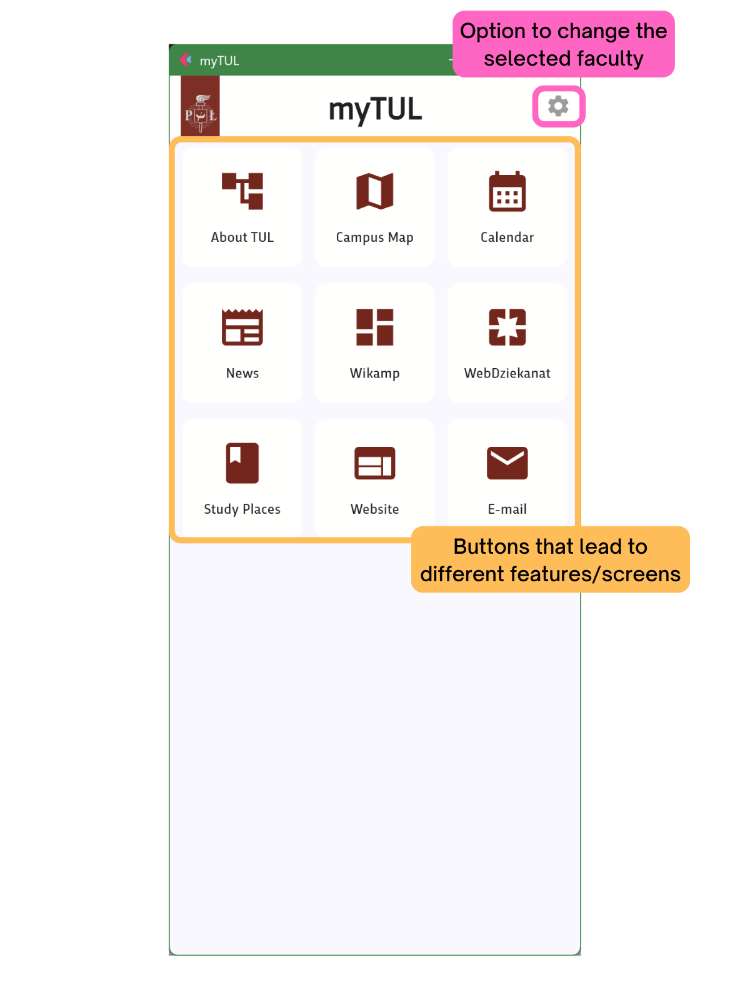
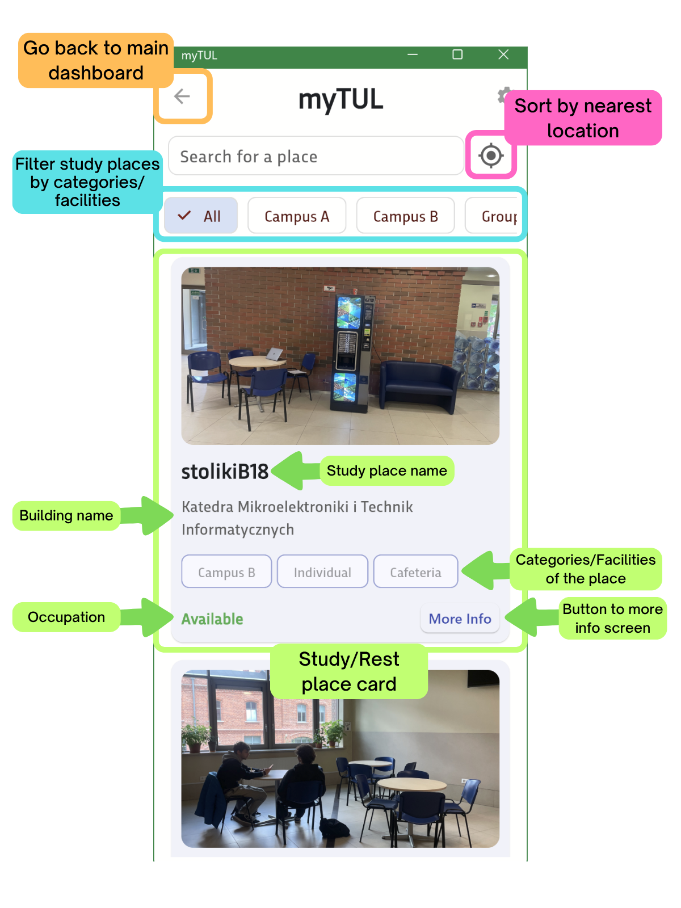

  

> A prototype application designed to help students at Lodz University of Technology find available study and rest spaces on campus using digital tools and AI-driven occupancy monitoring.

## 🚀 Project Overview

**myTUL** is a student-developed prototype addressing the lack of digital visibility into study and rest spaces across the TUL campus. It aims to:
- Help students discover underutilized study and relaxation spots.
- Present a unified platform for core academic tools.
- Provide visual and real-time insights into room occupancy using computer vision.

This project was created by Diginauts as part of the *Team Project* course at the International Faculty of Engineering, Lodz University of Technology.

> 📖 **Full report:** See `docs/myTUL_report.pdf` \
> 🖥️ **Final presentation:** See `docs/myTUL_presentation.pdf`

## 📱 Features

### 🌍 Study Places Module
- Interactive listing of study and rest areas with:
  - Photos
  - Room features (e.g. outlets, seating, quiet zones)
  - Campus and building locations
  - Filtering and sorting options

### 🧠 Smart Occupancy Monitoring
- YOLO-based computer vision model to detect and count people in study spaces
- Entry/exit logic using directional tracking
- Real-time occupancy data streamed via Firebase
- (Planned) predictive crowd graphs to assist student decision-making

### 🔗 Unified Academic Dashboard (Prototype)
- Quick access to key university services: Wikamp, Outlook, WebDziekanat, calendar
- Faculty-based content personalization

## 🛠️ Tech Stack

| Component              | Technology                         |
|------------------------|------------------------------------|
| Frontend UI            | Python + [Flet](https://flet.dev/) |
| Computer Vision Model  | YOLO + ByteTrack                   |
| Realtime DB            | Firebase Realtime Database         |
| Backend Service        | Python                             |
| Local Storage          | SQL + CSV                          |
| Version Control        | Git + GitHub                       |

## 📸 Screenshots

  
  
  

## 👥 Team

- **Klaudia Banasiewicz** – Team lead, main app developer (Flet, Python)
- **Marta Goltz** – UX/visual identity, data formatting, presentations
- **Yuriy Mosorov** – Computer vision model (YOLO + ByteTrack)
- **Laura Vazquez** – Data collection, photo documentation
- **Mieszko Strzelczyk** – Backend logic, database integration
- **Anna Talar** – Content for Study Places module

Supervised by **Dr Daria Drwal**

## ✅ Verification

User testing during PBL classes confirmed:
- Students were unaware of many study spaces on campus
- The prototype offers real value and strong potential for future implementation

## 🔮 Future Directions

- Integrate live university camera feeds
- Full mobile and web compatibility
- Real-time predictive occupancy graphs
- Booking system and AI recommendation system

## ℹ️ Sources

- [Logo of Lodz University of Technology](https://uslugirozwojowe.parp.gov.pl/plik/podglad?token=%242a%2406%24SBQuYMAAvZBrooax26iqw.)
- [Trasandina Font](https://fonts.adobe.com/fonts/trasandina)
- [Canva](https://www.canva.com/)

---
### **🎓 Developed with curiosity, collaboration, and a vision for a smarter campus.** ###