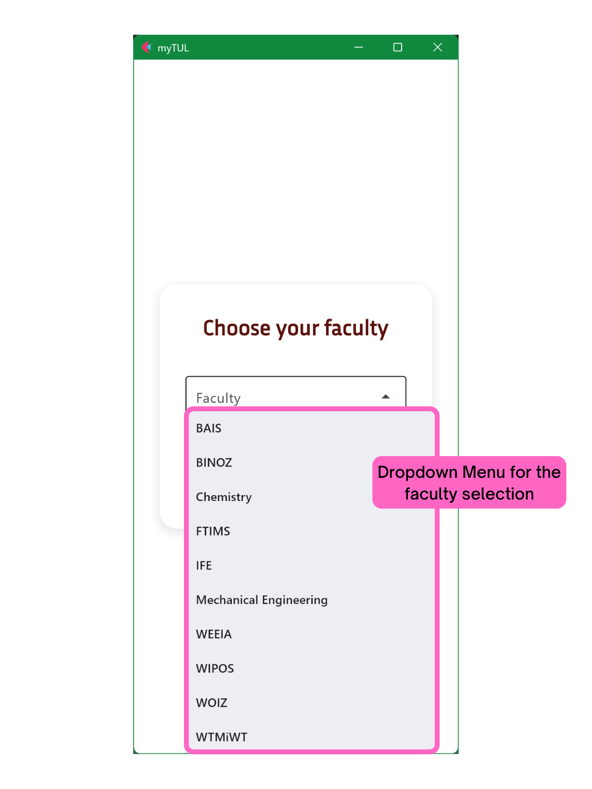
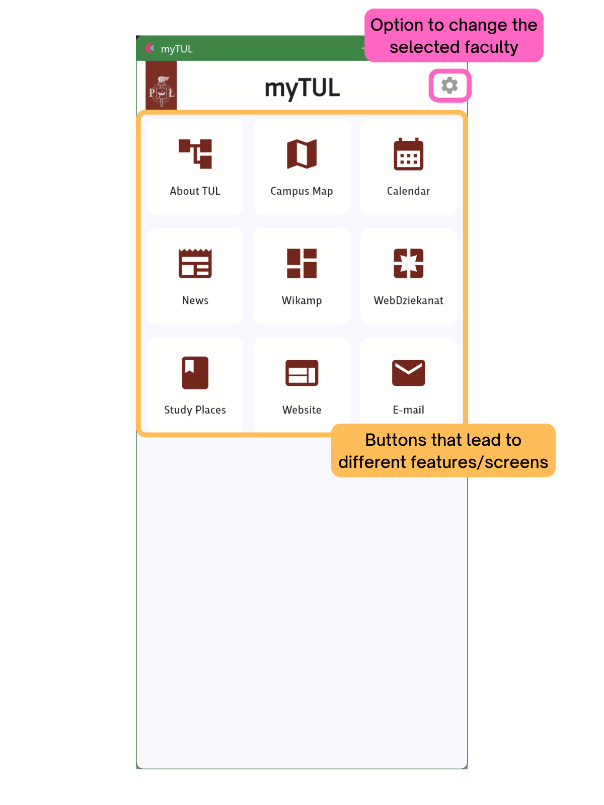
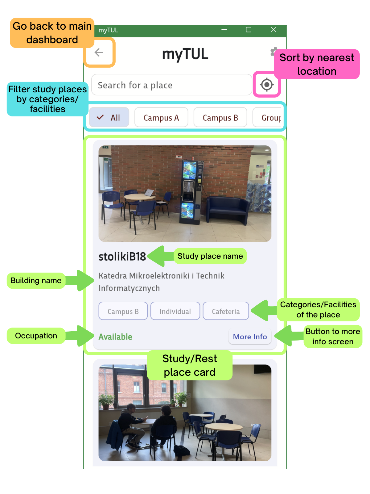

  

> A prototype application designed to help students at Lodz University of Technology find available study and rest spaces on campus using digital tools and AI-driven occupancy monitoring.

## 🚀 Project Overview

**myTUL** is a student-developed prototype created by the **Diginauts** team during the *Team Project* course at the International Faculty of Engineering, Lodz University of Technology. It addresses a key problem identified through interviews and research: **students have no reliable, digital way to view and compare available study and relaxation spaces on campus**.

This lack of digital visibility results in overcrowding of popular spots, inefficient use of available space, and undermines the image of TUL as a modern, tech-savvy university.

**myTUL** aims to:
- Help students discover underutilized spaces across various buildings.
- Offer an integrated dashboard for essential academic tools.
- Use AI and computer vision to provide real-time room occupancy insights.

> 📖 **Full report:** See `docs/myTUL_report.pdf` \
> 🖥️ **Final presentation:** See `docs/myTUL_presentation.pdf`

## 📱 Features

### 🌍 Study Places Module
- Interactive listing of study and rest areas with:
  - Photos
  - Room features (e.g. outlets, seating, quiet zones)
  - Campus and building locations
  - Filtering and sorting options

### 🧠 Smart Occupancy Monitoring
- YOLO-based computer vision model to detect and count people in study spaces
- Entry/exit logic using directional tracking
- Real-time occupancy data streamed via Firebase
- (Planned) predictive crowd graphs to assist student decision-making

### 🔗 Unified Academic Dashboard (Prototype)
- Quick access to key university services: 
  - Wikamp
  - Outlook
  - WebDziekanat
  - Campus Map
  - TUL Website and News
- Faculty-based content personalization

## 🛠️ Tech Stack

| Component              | Technology                         |
|------------------------|------------------------------------|
| Frontend UI            | Python + [Flet](https://flet.dev/) |
| Computer Vision Model  | YOLO + ByteTrack                   |
| Realtime DB            | Firebase Realtime Database         |
| Backend Service        | Python                             |
| Local Storage          | SQL + CSV                          |
| Version Control        | Git + GitHub                       |

## 📸 Screenshots

  
  
  

## 👥 Team

- [**Klaudia Banasiewicz**](https://www.linkedin.com/in/klaudiabanasiewicz/) – Team lead, main app developer (Flet, Python) 
- [**Marta Goltz**](https://www.linkedin.com/in/marta-goltz-66619b330/) – UX/visual identity, data formatting, presentations
- **Yuriy Mosorov** – Computer vision model (YOLO + ByteTrack)
- **Laura Vazquez** – Data collection, photo documentation
- [**Mieszko Strzelczyk**](https://www.linkedin.com/in/mieszko-strzelczyk-5a87a1356/) – Backend logic, database integration
- [**Anna Talar**](https://www.linkedin.com/in/anna-talar-37139a228/) – Content for Study Places module

Supervised by [**Daria Drwal**](https://fizyka.p.lodz.pl/doktoranci/dariadrwal/)

## ✅ Verification

- Validated during user testing in PBL classes.
- Most students didn’t know about many available study/rest areas.
- The solution was rated as valuable, usable, and needed.

## 🔮 Future Directions

- Live camera stream integration (with GDPR-compliant edge processing)
- Predictive crowd graphs based on historical data
- Mobile-first design & full browser support
- Booking system & personalized AI-based space suggestions
- Wi-Fi signal-based crowd sensing
- Support for off-campus places like cafés and libraries

## ⚖️ GDPR & Ethics

- Only anonymous, numerical occupancy data is stored.
- Real-time person detection runs on-device (edge computing), not in the cloud.
- No facial recognition, video recording, or personal identification is used.
- Transparency and informed consent are core to future deployment.

## 🌐 Broader Applications

The underlying technology is modular and reusable in:
- Libraries
- Cafés and co-working spaces
- Events and conferences
- Commercial locations like malls or airports

## ℹ️ Sources

- [Logo of Lodz University of Technology](https://uslugirozwojowe.parp.gov.pl/plik/podglad?token=%242a%2406%24SBQuYMAAvZBrooax26iqw.)
- [Trasandina Font](https://fonts.adobe.com/fonts/trasandina)
- [Canva](https://www.canva.com/)

---
### **🎓 Developed with curiosity, collaboration, and a vision for a smarter campus.** ###